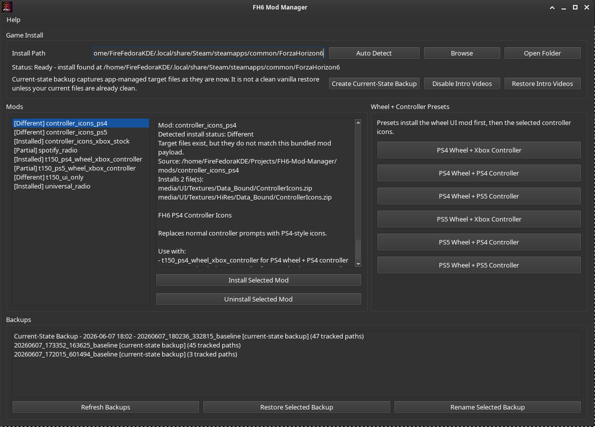

# FH6 Mod Manager

A small Linux desktop mod manager/template for Forza Horizon 6.

This is the public-safe version of the project. It is intentionally asset-free.

It does not include game files, extracted game assets, third-party icon packs, .swatchbin files, DLLs, FMOD banks, ControllerIcons.zip, WheelIcons.zip, radio mod payloads, or copied files from other mods.

Instead, this repo provides:

- the PySide6 manager app
- backup and restore logic
- intro video disable/restore tools
- preset support
- documentation
- an empty mods/ folder where users can place their own local mod payloads

Important:
This repository is a tool/template only. Users must download, build, or provide their own mod files locally. Do not redistribute game files or third-party mod assets unless you have permission from the original rights holder or mod author.

---

## What This App Does

FH6 Mod Manager installs and restores local FH6 mod payloads by copying files from this repo's mods/ folder into a selected Forza Horizon 6 install.

It was originally built around a Thrustmaster T150 wheel icon fix, but the app itself is generic enough to manage any FH6 mod folder that mirrors the game directory layout.

Current app features:

- auto-detects the Steam FH6 install folder on Linux
- allows manual FH6 folder selection
- installs local mod payload folders from mods/
- creates timestamped current-state and pre-install backups
- supports friendly backup names
- restores selected backup snapshots
- uninstalls a selected mod using the newest matching backup
- optionally removes files that did not exist before a mod install
- disables/restores intro videos by renaming files instead of deleting them
- supports preset buttons for common wheel/controller icon combinations when the matching local mod payloads are present
- shows install status such as Installed, Different, Partial, and Not installed
- includes a local launcher script and app icon

---

## What This Public Repo Does Not Include

This public repo intentionally does not include:

- Forza Horizon 6 game files
- extracted Forza UI files
- .swatchbin files
- UI.zip
- ControllerIcons.zip
- WheelIcons.zip
- DLL mod loaders
- FMOD .bank files
- Universal Radio payloads
- Spotify Radio payloads
- PS4/PS5 icon pack payloads
- any third-party mod files

The private/local working version can contain those files for personal use, but they should not be redistributed publicly unless their licenses or permissions allow it.

---

## Basic Mod Folder Format

Mods go in:

    mods/

Each mod folder should mirror the FH6 install directory.

Example UI mod:

    mods/my_ui_mod/
    ├── README.txt
    └── media/
        └── UI.zip

Example root-level mod:

    mods/my_radio_mod/
    ├── version.dll
    ├── fh6-radio/
    └── media/

When installed, the app copies the contents of the selected mod folder into the selected Forza Horizon 6 install folder.

---

## Screenshot

Add screenshot here later:

    

---

## Current Features

### Game install detection

The app auto-detects the Steam install path:

```text
~/.local/share/Steam/steamapps/common/ForzaHorizon6
```

You can also browse manually.

### Mod install system

Mods are stored under:

```text
mods/
```

Each mod folder mirrors the FH6 game folder layout.

Example:

```text
mods/t150_ps4_wheel_xbox_controller/
└── media/
    ├── UI.zip
    └── UI/
        └── Textures/
            ├── Data_Bound/
            │   └── WheelIcons.zip
            └── HiRes/
                └── Data_Bound/
                    └── WheelIcons.zip
```

Installing a mod copies its files into the selected FH6 folder.

### Backups

Before installing a mod, the app creates a backup snapshot inside the game folder:

```text
ForzaHorizon6/.fh6_mod_manager_backups/
```

Backups include a `manifest.json` that tracks:

* the backup label
* friendly display name
* files tracked
* whether each file existed before the mod was installed

The backup system supports:

* restoring selected backup snapshots
* uninstalling a selected mod using its newest backup
* optionally removing files that did not exist before install
* renaming backups with friendly names

### Current-State Backup

The **Create Current-State Backup** button backs up all app-managed target files as they exist right now.

This does **not** mean clean vanilla unless the files are already clean/vanilla when the backup is made.

For my setup, current-state backups may represent a known-good modded state, such as:

```text
Known working - PS4 wheel + Xbox controller + Universal Radio installed
```

### Intro video controls

The app can disable/restore intro videos by renaming files instead of deleting them.

Disabled intro videos use the suffix:

```text
.fh6mm.disabled
```

---

## Included Mod Options

### Wheel icon mods

These change raw numbered T150 wheel prompts.

#### `t150_ps4_wheel_xbox_controller`

Replaces the Thrustmaster T150 raw numbered wheel prompts with PS4-style wheel icons while leaving normal controller prompts alone.

This mod installs:

```text
media/UI.zip
media/UI/Textures/Data_Bound/WheelIcons.zip
media/UI/Textures/HiRes/Data_Bound/WheelIcons.zip
```

It does **not** install `ControllerIcons.zip`.

That means controller icons stay whatever controller icon pack is currently installed.

#### `t150_ps5_wheel_xbox_controller`

Same idea, but with PS5/DualSense-style wheel icons.

Button 13 uses a fallback because the PS5 icon pack did not include a dedicated PS/Home/Guide icon.

### Controller icon packs

These replace normal controller prompts.

#### `controller_icons_xbox_stock`

Restores stock Xbox-style controller prompts.

Installs:

```text
media/UI/Textures/Data_Bound/ControllerIcons.zip
media/UI/Textures/HiRes/Data_Bound/ControllerIcons.zip
```

#### `controller_icons_ps4`

Replaces normal controller prompts with PS4-style icons.

#### `controller_icons_ps5`

Replaces normal controller prompts with PS5/DualSense-style icons.

### Radio mods

#### `universal_radio`

Installs the Universal Radio mod payload.

#### `spotify_radio`

Installs the Spotify Radio mod payload.

> **Warning:** Universal Radio and Spotify Radio are alternative radio mods. They should not be installed together. Use one or the other.

---

## Presets

The app includes preset buttons that install mods in order.

### PS4 wheel presets

#### PS4 Wheel + Xbox Controller

Installs:

```text
t150_ps4_wheel_xbox_controller
controller_icons_xbox_stock
```

Result:

```text
T150 wheel prompts = PS4 icons
Controller prompts = Xbox icons
Keyboard prompts = unchanged
```

#### PS4 Wheel + PS4 Controller

Installs:

```text
t150_ps4_wheel_xbox_controller
controller_icons_ps4
```

Result:

```text
T150 wheel prompts = PS4 icons
Controller prompts = PS4 icons
Keyboard prompts = unchanged
```

#### PS4 Wheel + PS5 Controller

Installs:

```text
t150_ps4_wheel_xbox_controller
controller_icons_ps5
```

Result:

```text
T150 wheel prompts = PS4 icons
Controller prompts = PS5 icons
Keyboard prompts = unchanged
```

### PS5 wheel presets

#### PS5 Wheel + Xbox Controller

Installs:

```text
t150_ps5_wheel_xbox_controller
controller_icons_xbox_stock
```

Result:

```text
T150 wheel prompts = PS5 icons
Controller prompts = Xbox icons
Keyboard prompts = unchanged
```

#### PS5 Wheel + PS4 Controller

Installs:

```text
t150_ps5_wheel_xbox_controller
controller_icons_ps4
```

Result:

```text
T150 wheel prompts = PS5 icons
Controller prompts = PS4 icons
Keyboard prompts = unchanged
```

#### PS5 Wheel + PS5 Controller

Installs:

```text
t150_ps5_wheel_xbox_controller
controller_icons_ps5
```

Result:

```text
T150 wheel prompts = PS5 icons
Controller prompts = PS5 icons
Keyboard prompts = unchanged
```

---

## Credits / Thanks

This project would not exist without the modding work and tools from other people.

### PlayStation Controller Icons / DualSense Icons

Used as a source/reference for PS5/DualSense-style controller prompt assets.

* Nexus Mods page: https://www.nexusmods.com/forzahorizon6/mods/2
* Author shown on Nexus: `fxckedinside`

Thank you for making high-quality PlayStation controller icon replacements.

### Spotify Radio

Used as one of the optional radio mod install payloads.

* Nexus Mods page: https://www.nexusmods.com/forzahorizon6/mods/95

Thank you for the Spotify Radio mod.

### Universal Radio

Used as one of the optional radio mod install payloads.

* Nexus Mods page: https://www.nexusmods.com/forzahorizon6/mods/215

Thank you for the Universal Radio mod.

### PS4 controller icon source

Used as a source/reference for PS4-style controller prompt assets.

* Local downloaded file name used during development:

```text
PlaySation Icons-15-1-0-1778817541.rar
```

If this repo ever gets cleaned up for public documentation, replace this section with the exact Nexus page and author credit.

### FH6 icon/app artwork

The app icon in:

```text
resources/icons/fh6-mod-manager.png
```

was generated for this personal project. It is intended to be generic and unofficial.

---

## Disclaimer

This project is unofficial.

It is not affiliated with, endorsed by, or supported by Playground Games, Turn 10, Xbox Game Studios, Microsoft, Steam, Sony, Thrustmaster, Spotify, or any mod author mentioned here.

Use at your own risk.

Always back up your files.

---

# Development Setup

## Requirements

* Linux
* Python 3
* PySide6
* Pillow, used for the icon-building/repacking helper workflow
* Git
* Steam version of FH6 installed locally

Install Python dependencies:

```bash
cd ~/Projects/FH6-Mod-Manager

python3 -m venv .venv
source .venv/bin/activate
pip install -r requirements.txt
pip install Pillow
```

Run the app:

```bash
python -m app.main
```

Or use the launcher script:

```bash
scripts/launch-fh6-mod-manager.sh
```

---

## Local Launcher

A local launcher script exists at:

```text
scripts/launch-fh6-mod-manager.sh
```

It:

* resolves the repo path dynamically
* activates/creates the venv
* installs requirements if needed
* launches the app
* supports printing the icon path with:

```bash
scripts/launch-fh6-mod-manager.sh --print-icon
```

Example `.desktop` file:

```ini
[Desktop Entry]
Type=Application
Name=FH6 Mod Manager
Comment=Install and restore Forza Horizon 6 mods
Exec=fh6-mod-manager
Icon=/home/FireFedoraKDE/Projects/FH6-Mod-Manager/resources/icons/fh6-mod-manager.png
Terminal=false
Categories=Game;Utility;
StartupNotify=true
```

---

# How the T150 Wheel Icon Fix Works

## The original problem

When using a wheel like the **Thrustmaster T150**, Forza shows generic numbered wheel prompts instead of PlayStation-style icons.

Example:

```text
1
2
3
4
5
6
```

The goal was to replace those raw numbered prompts with proper PlayStation button icons.

My T150 button mapping from Linux joystick testing was:

```text
jstest /dev/input/js2
```

Observed mapping:

```text
X / Cross       = jstest button 5  = Forza raw button 6
O / Circle      = jstest button 4  = Forza raw button 5
Triangle        = jstest button 2  = Forza raw button 3
Square          = jstest button 3  = Forza raw button 4
Share / Select  = jstest button 6  = Forza raw button 7
Options / Start = jstest button 7  = Forza raw button 8
L1 / Downshift  = jstest button 0  = Forza raw button 1
R1 / Upshift    = jstest button 1  = Forza raw button 2
L2              = jstest button 9  = Forza raw button 10
R2              = jstest button 8  = Forza raw button 9
L3              = jstest button 10 = Forza raw button 11
R3              = jstest button 11 = Forza raw button 12
PS/Home-ish     = jstest button 12 = Forza raw button 13
```

Final T150 mapping:

```text
1  = L1 / Downshift
2  = R1 / Upshift
3  = Triangle
4  = Square
5  = Circle
6  = Cross
7  = Share / View
8  = Options / Menu
9  = R2
10 = L2
11 = L3
12 = R3
13 = PS/Home fallback
```

---

## Files involved

FH6 uses UI archives under:

```text
ForzaHorizon6/media/
```

Important files:

```text
media/UI.zip
media/UI/Textures/Data_Bound/ControllerIcons.zip
media/UI/Textures/HiRes/Data_Bound/ControllerIcons.zip
media/UI/Textures/Data_Bound/WheelIcons.zip
media/UI/Textures/HiRes/Data_Bound/WheelIcons.zip
```

### `ControllerIcons.zip`

Contains normal controller icon textures.

Examples:

```text
Controller_A.swatchbin
Controller_B.swatchbin
Controller_X.swatchbin
Controller_Y.swatchbin
Controller_LB.swatchbin
Controller_RB.swatchbin
Controller_LT.swatchbin
Controller_RT.swatchbin
Controller_View.swatchbin
Controller_Menu.swatchbin
Controller_L3.swatchbin
Controller_R3.swatchbin
Medium/Controller_A.swatchbin
...
```

Replacing `ControllerIcons.zip` changes regular controller prompts.

### `WheelIcons.zip`

Contains raw wheel prompt textures.

Examples:

```text
Wheel_Controller_1.swatchbin
Wheel_Controller_2.swatchbin
Wheel_Controller_3.swatchbin
...
Wheel_Controller_16.swatchbin
Medium/Wheel_Controller_1.swatchbin
Medium/Wheel_Controller_2.swatchbin
...
```

Replacing `WheelIcons.zip` lets the wheel use custom icons without touching normal controller icons.

### `UI.zip`

Contains XAML UI logic.

Important entries:

```text
Resources/Anthem/Global_DefaultStyles.xaml
Resources/Anthem/Global_Textures.xaml
```

`Global_DefaultStyles.xaml` controls which image resource a controller/wheel prompt uses.

`Global_Textures.xaml` defines image resources like controller buttons, wheel buttons, raw controller backgrounds, etc.

---

# Discovery Process

## Step 1: Back up stock files

Before editing anything:

```bash
FH6="$HOME/.local/share/Steam/steamapps/common/ForzaHorizon6"
MOD="$HOME/Projects/fh6-wheel-icons"

mkdir -p "$MOD/backup"

cp "$FH6/media/UI.zip" \
   "$MOD/backup/UI.stock.zip"

cp "$FH6/media/UI/Textures/Data_Bound/WheelIcons.zip" \
   "$MOD/backup/WheelIcons.Data_Bound.stock.zip"

cp "$FH6/media/UI/Textures/HiRes/Data_Bound/WheelIcons.zip" \
   "$MOD/backup/WheelIcons.HiRes.stock.zip"

cp "$FH6/media/UI/Textures/Data_Bound/ControllerIcons.zip" \
   "$MOD/backup/ControllerIcons.Data_Bound.stock.zip"

cp "$FH6/media/UI/Textures/HiRes/Data_Bound/ControllerIcons.zip" \
   "$MOD/backup/ControllerIcons.HiRes.stock.zip"
```

Later, before installing PS4/PS5 controller icon mods, stock Xbox icons were backed up as:

```text
ControllerIcons.Data_Bound.before-ps4.zip
ControllerIcons.HiRes.before-ps4.zip
```

---

## Step 2: Inspect the wheel icon archives

```bash
unzip -l "$FH6/media/UI/Textures/Data_Bound/WheelIcons.zip" \
  | grep -Ei 'Wheel_Controller|Raw_Controller|Medium'
```

This revealed files like:

```text
Wheel_Controller_1.swatchbin
Wheel_Controller_2.swatchbin
...
Wheel_Controller_16.swatchbin
Medium/Wheel_Controller_1.swatchbin
...
```

That proved the wheel had its own texture archive separate from normal controller icons.

---

## Step 3: Extract the PlayStation controller icon packs

For PS4:

```bash
mkdir -p ~/Projects/fh6-wheel-icons/work/PS4_Data_Bound
mkdir -p ~/Projects/fh6-wheel-icons/work/PS4_HiRes

unzip -q ~/Projects/fh6-wheel-icons/ps4buttons/media/UI/Textures/Data_Bound/ControllerIcons.zip \
  -d ~/Projects/fh6-wheel-icons/work/PS4_Data_Bound

unzip -q ~/Projects/fh6-wheel-icons/ps4buttons/media/UI/Textures/HiRes/Data_Bound/ControllerIcons.zip \
  -d ~/Projects/fh6-wheel-icons/work/PS4_HiRes
```

For PS5:

```bash
mkdir -p ~/Projects/fh6-wheel-icons/work/PS5_Data_Bound
mkdir -p ~/Projects/fh6-wheel-icons/work/PS5_HiRes

unzip -q ~/Projects/fh6-wheel-icons/ps5buttons/media/UI/Textures/Data_Bound/ControllerIcons.zip \
  -d ~/Projects/fh6-wheel-icons/work/PS5_Data_Bound

unzip -q ~/Projects/fh6-wheel-icons/ps5buttons/media/UI/Textures/HiRes/Data_Bound/ControllerIcons.zip \
  -d ~/Projects/fh6-wheel-icons/work/PS5_HiRes
```

Then inspect:

```bash
find ~/Projects/fh6-wheel-icons/work/PS5_Data_Bound ~/Projects/fh6-wheel-icons/work/PS5_HiRes \
  -type f | sort | grep -Ei 'Controller_(A|B|X|Y|LB|RB|LT|RT|VIEW|MENU|L3|R3|LeftThumb|RightThumb|Unknown|PS|Home|Guide)'
```

The PS5 pack had the main controller buttons but did not have a dedicated PS/Home icon.

---

# Why the First Attempt Was Not Enough

At first, the raw wheel prompt textures were replaced directly.

Example:

```text
Wheel_Controller_6.swatchbin = Controller_A.swatchbin
```

This partially worked: the PlayStation icon appeared underneath.

But the number was still drawn over it.

That meant the number was not part of the texture. It was separate text drawn by the UI.

The important binding was found in:

```text
Resources/Anthem/Global_DefaultStyles.xaml
```

Specifically:

```xml
<local:FZTextBlock Text="{Binding RawControllerForegroundText, RelativeSource={RelativeSource AncestorType=local:ControllerButtonControl}}"
                   Style="{StaticResource A_Style_FZTextBlock_HorizonA}"
                   Color="{StaticResource H_Color_Primary_Black}"
                   ...>
</local:FZTextBlock>
```

`RawControllerForegroundText` is the number overlay.

---

# Hiding the Raw Wheel Numbers

The fix was to patch the color of the raw number text to transparent:

```xml
Color="#00000000"
```

Instead of:

```xml
Color="{StaticResource H_Color_Primary_Black}"
```

This kept the UI layout intact but made the number invisible.

A Python patch script was used to edit `Global_DefaultStyles.xaml` inside `UI.zip` and repack it while preserving the archive style.

Conceptual script:

```python
from pathlib import Path
import sys
import zipfile
import re

TOOLS = Path.home() / "Projects/fh6-icon-tools"
MOD = Path.home() / "Projects/fh6-wheel-icons"

sys.path.insert(0, str(TOOLS / "tools"))
from png_to_swatchbin import write_replaced_zip

template = MOD / "backup/known-good-ps4-booting/UI.zip"
out = MOD / "work/UI.HIDE_RAW_NUMBERS.preserve.zip"
entry = "Resources/Anthem/Global_DefaultStyles.xaml"

with zipfile.ZipFile(template, "r") as zf:
    xaml = zf.read(entry).decode("utf-8")

pattern = r'(<local:FZTextBlock\s+Text="\{Binding RawControllerForegroundText,[\s\S]*?)Color="\{StaticResource H_Color_Primary_Black\}"'
replacement = r'\1Color="#00000000"'

xaml_new, count = re.subn(pattern, replacement, xaml, count=1)

if count != 1:
    raise SystemExit("Could not patch raw number color.")

write_replaced_zip(
    template,
    out,
    {entry: xaml_new.encode("utf-8")},
    zip_style="preserve",
)
```

---

# Mapping Raw Wheel Buttons to Icons

After hiding the raw number overlay, the next step was mapping each raw button number to the correct icon.

The UI patch adds triggers like:

```xml
<MultiDataTrigger>
    <MultiDataTrigger.Conditions>
        <Condition Binding="{Binding InputDeviceType, RelativeSource={RelativeSource AncestorType=local:ControllerButtonControl}}" Value="{x:Static local:XAMLInputDeviceType.RawGameController}" />
        <Condition Binding="{Binding RawControllerForegroundText, RelativeSource={RelativeSource AncestorType=local:ControllerButtonControl}}" Value="6" />
    </MultiDataTrigger.Conditions>
    <Setter Property="ImageSource" Value="{StaticResource A_BitmapImage_T150WheelButton_6}" />
</MultiDataTrigger>
```

This says:

```text
If the input device is a raw game controller
and the displayed raw wheel button number is 6
use the T150 wheel button 6 image.
```

That allowed precise mapping:

```text
Raw 6 = Cross
Raw 5 = Circle
Raw 4 = Square
Raw 3 = Triangle
...
```

---

# Phase 1 vs Phase 2

## Phase 1: Shared controller icons

The first working version mapped raw wheel buttons to normal controller resources like:

```text
A_BitmapImage_ControllerButton_A
A_BitmapImage_ControllerButton_B
A_BitmapImage_ControllerButton_X
A_BitmapImage_ControllerButton_Y
```

That worked, but it meant wheel icons and controller icons always matched.

Example:

```text
PS4 ControllerIcons.zip installed
= PS4 controller icons + PS4 wheel icons
```

But if stock Xbox controller icons were restored:

```text
Stock ControllerIcons.zip installed
= Xbox controller icons + Xbox wheel icons
```

This was not flexible enough.

## Phase 2: Separate wheel-only resources

The clean version created separate T150 wheel resources and stored PlayStation icons inside `WheelIcons.zip`.

That allowed:

```text
WheelIcons.zip = PlayStation wheel icons
ControllerIcons.zip = Xbox controller icons
```

Final result:

```text
T150 wheel prompts = PlayStation icons
Xbox controller prompts = Xbox icons
Keyboard prompts = keyboard icons
```

This is the important breakthrough.

---

# Adding Wheel-Only Resources

In `Global_Textures.xaml`, extra image resources were added like:

```xml
<ImageSource x:Key="A_BitmapImage_T150WheelButton_1">/ForzaUI;component/Textures/Data_Bound/WheelIcons/Wheel_Controller_1.png</ImageSource>
<ImageSource x:Key="A_BitmapImage_T150WheelButton_1_Large">/ForzaUI;component/Textures/Data_Bound/WheelIcons/Medium/Wheel_Controller_1.png</ImageSource>
```

The same pattern was created for buttons 1 through 13.

Then `Global_DefaultStyles.xaml` was patched so raw wheel buttons point to:

```text
A_BitmapImage_T150WheelButton_1
A_BitmapImage_T150WheelButton_2
...
A_BitmapImage_T150WheelButton_13
```

Instead of normal controller button resources.

---

# Building PS4 / PS5 WheelIcons.zip

The final process:

1. Start from stock `WheelIcons.zip`.
2. Copy PlayStation `Controller_*.swatchbin` files into matching `Wheel_Controller_*.swatchbin` slots.
3. Preserve archive formatting using `write_replaced_zip`.
4. Keep `ControllerIcons.zip` separate.

Example mapping:

```python
mapping = {
    "1":  "LB",
    "2":  "RB",
    "3":  "Y",
    "4":  "X",
    "5":  "B",
    "6":  "A",
    "7":  "VIEW",
    "8":  "MENU",
    "9":  "RT",
    "10": "LT",
    "11": "L3",
    "12": "R3",
    "13": "Unknown",
}
```

For PS5, button 13 fell back to `Controller_MENU` because the PS5 pack did not include a dedicated PS/Home/Guide/Unknown icon.

---

# Repacking Archives Safely

The game was sensitive to how files were repacked.

Do **not** casually extract and re-zip with random archive settings if the game crashes.

The working method used a helper function:

```python
from png_to_swatchbin import write_replaced_zip
```

This allowed replacing specific entries inside an existing zip while preserving enough of the archive structure/style for the game to keep booting.

Conceptual example:

```python
write_replaced_zip(
    template_zip,
    output_zip,
    {
        "Resources/Anthem/Global_DefaultStyles.xaml": patched_styles.encode("utf-8"),
        "Resources/Anthem/Global_Textures.xaml": patched_textures.encode("utf-8"),
    },
    zip_style="preserve",
)
```

For texture archives:

```python
write_replaced_zip(
    stock_wheelicons_zip,
    output_wheelicons_zip,
    {
        "Wheel_Controller_6.swatchbin": ps_cross_data,
        "Medium/Wheel_Controller_6.swatchbin": ps_cross_medium_data,
    },
    zip_style="preserve",
)
```

This was much safer than rebuilding the whole archive from scratch.

---

# Verifying Patches

## Check that raw number text is hidden

```bash
unzip -p "$FH6/media/UI.zip" Resources/Anthem/Global_DefaultStyles.xaml \
  | grep -n -A8 -B4 'RawControllerForegroundText\|Color="#00000000"'
```

Expected:

```xml
<local:FZTextBlock Text="{Binding RawControllerForegroundText, ...}"
                   Color="#00000000"
                   ...>
```

## Check WheelIcons.zip entries

```bash
unzip -l "$FH6/media/UI/Textures/Data_Bound/WheelIcons.zip" \
  | grep -Ei 'Wheel_Controller|Medium'
```

## Compare installed files to mod payload

The app does this automatically.

It displays statuses like:

```text
[Installed]
[Different]
[Partial]
[Not installed]
```

---

# Restoring / Recovery

If a UI patch breaks the game, restore `UI.zip`:

```bash
cp "$MOD/backup/known-good-ps4-booting/UI.zip" "$FH6/media/UI.zip"
```

Restore stock WheelIcons:

```bash
cp "$MOD/backup/WheelIcons.Data_Bound.stock.zip" \
   "$FH6/media/UI/Textures/Data_Bound/WheelIcons.zip"

cp "$MOD/backup/WheelIcons.HiRes.stock.zip" \
   "$FH6/media/UI/Textures/HiRes/Data_Bound/WheelIcons.zip"
```

Restore stock Xbox ControllerIcons:

```bash
cp "$MOD/backup/ControllerIcons.Data_Bound.before-ps4.zip" \
   "$FH6/media/UI/Textures/Data_Bound/ControllerIcons.zip"

cp "$MOD/backup/ControllerIcons.HiRes.before-ps4.zip" \
   "$FH6/media/UI/Textures/HiRes/Data_Bound/ControllerIcons.zip"
```

Or use the app’s backup restore system.

---

# Repository Layout

Current layout:

```text
FH6-Mod-Manager/
├── app/
│   ├── backup.py
│   ├── main.py
│   ├── mod_manager.py
│   └── paths.py
├── mods/
│   ├── controller_icons_ps4/
│   ├── controller_icons_ps5/
│   ├── controller_icons_xbox_stock/
│   ├── spotify_radio/
│   ├── t150_ps4_wheel_xbox_controller/
│   ├── t150_ps5_wheel_xbox_controller/
│   ├── t150_ui_only/
│   └── universal_radio/
├── resources/
│   └── icons/
│       └── fh6-mod-manager.png
├── scripts/
│   └── launch-fh6-mod-manager.sh
├── requirements.txt
└── README.md
```

---

# Development Notes

## Running checks

Compile check:

```bash
python -m py_compile app/main.py app/mod_manager.py app/backup.py app/paths.py
```

Offscreen PySide smoke test:

```bash
QT_QPA_PLATFORM=offscreen python -c '
import sys
from PySide6.QtWidgets import QApplication
from app.main import MainWindow

app = QApplication(sys.argv)
window = MainWindow()
print(f"title={window.windowTitle()}")
print(f"mod_count={len(window.mod_entries)}")
window.close()
app.quit()
'
```

Expected output:

```text
title=FH6 Mod Manager
mod_count=8
```

## Git workflow

Checkpoint often:

```bash
git status
git add .
git commit -m "Describe change"
git push
```

---

# Future Ideas

Possible future improvements:

* Add radio presets:

  * Install Universal Radio
  * Install Spotify Radio
  * Restore previous radio setup
* Add explicit conflict warnings for mods that touch the same files
* Add file-level diff/preview before install
* Add mod categories:

  * Wheel Icons
  * Controller Icons
  * Radio
  * UI / Misc
* Add a “known good setup” preset
* Add export/import backup metadata
* Improve app styling with a custom theme
* Add a public-safe mode that does not include third-party mod files
* Build an AppImage or simple local installer
* Add screenshot previews for icon packs
* Add direct “Open backup folder” button

---

# Personal Notes

This project was built because FH6 raw wheel prompts were ugly with a T150 on Linux.

The final setup allows flexible combinations:

```text
PS4 wheel + Xbox controller
PS4 wheel + PS4 controller
PS4 wheel + PS5 controller
PS5 wheel + Xbox controller
PS5 wheel + PS4 controller
PS5 wheel + PS5 controller
```

And the manager makes it easy to reapply those setups after a game update or Steam file verification.

